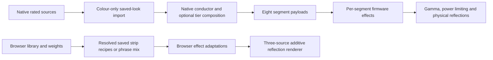

# Physical Auto DJ: spatial composition handoff

**Prepared:** 5 October 2026 · **Audience:** native API, firmware and Flutter engineers  
**Objective:** combine the native DJ’s musical timing, controls and hardware protections with the virtual DJ’s use of independent shelf illumination and layered desktop reflections.

## 1. Recommended change

Introduce an opt-in native arrangement compiler that can preserve a saved look’s validated **music effect, effect-specific speed/intensity, palette identity and direction on each of eight strips**. Add curated arrangements that treat underside strips **1, 2 and 3 as three optical sources**, while retaining the existing five vertical tiers for legacy effects and composition.

The firmware already dispatches music effects per segment. The first implementation can therefore be an API/app change using existing firmware fields. Additional firmware phase or palette-position controls should follow only if a measured comparison identifies a remaining gap.

The strongest confirmed differences are:

1. Native Auto DJ deliberately reduces stored segment recipes to **ID/colour/palette ID**. It discards authored FX/SX/IX/direction and `upal_ref`; its WLED fallback extracts only ID/colour. Browser phrase playback uses the full **resolved** saved strip recipe.
2. Native composition requires strips 1 and 2 to share a tier plan. The preview combines three independent reflected pixel sources, including strip 3. Saved browser looks can give all three different recipes.
3. Matching settings labels or numbers do not establish matching output. Browser audio normalization, effect parameter meanings, palette placement and additive reflections differ from native rendering.

These findings explain plausible mechanisms for the reported difference. They do **not** establish which mechanism dominates on the running desk. This review examined local source and supplied images, without querying, commanding or flashing hardware.

## 2. Evidence and reproducibility

Native source root, abbreviated **PF** below:

`/home/ergo/ErgoFlex_Desk_Stack/Polish-Features`

Browser source root, abbreviated **CS**:

`/home/ergo/ErgoFlex_Custom_Shop`

| Item | Reviewed state |
| --- | --- |
| Native Git HEAD | `2514ab69702d591eaf225d5b210357d17a5bd927` |
| Browser Git HEAD | `865277cb127883386316e985e9271ccccedd59e4` |
| Working trees | Both contain local changes. HEAD alone does not identify the reviewed files; use the accompanying SHA-256 manifest and source snapshots. |
| Local firmware version macro | `0.21.2-seg5-gpio26-retest` in modified `src/config.h`; running firmware identity unverified. |
| Browser source imports | `desktop-bands-back-20261005`; screenshots do not independently identify their loaded source version. Current source includes a later five-inch rearward reflection shift. |
| Screenshots | 55 originals, 16:59:37–17:03:37 on 5 October. Representative copies included; all original paths/hashes listed in the manifest. |
| Physical evidence | Earlier supplied desk photograph `20261005_153416.jpg`; demonstrates real layered colour pools, not a matched current native-DJ run. |

### What the images establish

The screenshots show **My rotation**, **Mix Across Shelves checked**, **Standard flash comfort** and **100% preview brightness**. They show colour separation along strip width, different depth rows on the desktop, and dark areas between moving coloured regions. The spatial appeal includes contrast and selective illumination, not just total brightness.

| Reference | Visible subject | Engineering use |
| --- | --- | --- |
| [Dynamic, 17:01:34](physical-auto-dj-reference/evidence/dynamic-170134.png) | Different upper-shelf, desktop and footrest colours | Preserve authored recipe differences and palette identity. |
| [Mexican Power, 17:02:39](physical-auto-dj-reference/evidence/mexican-power-170239.png) | Strong palette sections and layered illumination | Compare resolved eight-strip recipes; test flash filtering. |
| [G (Copy) (Copy), 17:02:42](physical-auto-dj-reference/evidence/g-copy-170242.png) | A saved multi-effect look | Candidate for three-source authored playback. |
| [Ripple, 17:00:47](physical-auto-dj-reference/evidence/ripple-170047.png) | Moving colour sections across several surfaces | Study horizontal colour placement separately from native vertical ripple timing. |
| [Reggae Sounds, 17:01:00](physical-auto-dj-reference/evidence/reggae-170100.png) | Blue/magenta regions with dark space | Compare Spectrum band-selection semantics. |
| [BlueRed Sound, 17:03:35](physical-auto-dj-reference/evidence/blue-red-170335.png) | Another single-effect saved look | Control case: recipe preservation alone may leave renderer differences. |
| [Physical desk photograph](physical-auto-dj-reference/evidence/physical-desk-153416.jpg) | Real separated reflected colour pools | Verify actual source-to-surface geometry and overlap. |

Stills cannot establish beat alignment, motion smoothness, transition duration, event state or simultaneous physical equivalence. A screenshot labelled Drop does not prove which firmware Drop state would have been active.

## 3. Geometry: preserve both useful models

Electrical counts match between the browser map and the modified local Desk 02 firmware configuration: **106 pixels**. This is not evidence of a higher-resolution virtual strip. Browser endpoints and surface assignments remain explicitly provisional.

| Segment ID | Browser label | Local count | Existing vertical tier | Proposed spatial responsibility |
| --- | --- | ---: | ---: | --- |
| 0 | Top Shelf Top | 14 | 0 | Head accent |
| 1 | Top Shelf Bottom Back | 14 | 1 | Independent underside source A |
| 2 | Top Shelf Bottom Front | 15 | 1 | Independent underside source B |
| 3 | Second Shelf | 14 | 2 | Independent underside/core source C |
| 4 | Desk Top Center | 14 | 3 | Desktop support |
| 5 | Desktop Left | 11 | 3 | Left wing, coordinated with desktop |
| 6 | Desktop Right | 11 | 3 | Right wing, coordinated with desktop |
| 7 | Foot Rest | 13 | 4 | Bass/floor anchor |

Native `services/music_auto_dj_tiers.go` and firmware `EffectEngine.h:72` use `[0,1,1,2,3,3,3,4]`. **Keep this mapping.** Tower, Ripple, Bass Sky and ambient behavior depend on it. Add optical roles alongside it; do not relabel strips into new vertical tiers.

The current preview’s desktop reflection rows use sources **3 → 2 → 1**, from rear to front, with X centres **−171, −164, −157**, widths **0.85, 1.0, 1.15** and gains **1.0, 0.8, 0.65** (`studio.js:3313`). These are renderer geometry and appearance values, not LED PWM targets or verified physical attenuation coefficients. Confirm source order by illuminating one physical strip at a time before calibration.

## 4. Current pipelines and confirmed gaps

### 4.1 Authored recipe loss is deliberate and scoped

`music_auto_dj_runtime.go:408–525` documents and implements colour-only import. `djSanitizeStoredSegs` delegates to `sanitizeRemixSegs` (`music_auto_dj_deck.go:403`), which retains ID/Col/Pal but removes FX, SX, IX, reverse, mirror, power and `UpalRef`. Segments containing no retained paint are dropped. `djSegsFromWledPayload` extracts ID/Col only.

The existing policy has concrete reasons:

- The general music segment validator also accepts static FX 0–33. Static Strobe 22 does not use the music comfort guard. Blindly preserving saved effects creates a flash-policy hole.
- A five-tier status plan cannot truthfully describe different effects on strips 1 and 2.
- The DJ does not own segment power. Stored `on:false` is intentionally excluded.
- Copying and sanitizing without mutation prevents source corruption and stale-colour carryover.

Retain this policy for the legacy path and colour-remix inputs. Build a distinct, validated authored-music path. Update tests by mode rather than weakening the existing invariant globally. Manual preset behavior is outside this change.

### 4.2 Composition exists, but follows vertical tiers

`music_auto_dj_compose.go` contains curated neutral, bass-anchor, head-shimmer, rising-floor, tower-stack, split-desk, ember and tideline recipes. Replacement tiers get their own effect parameters. The native system is already a composition engine.

Its restriction is meaningful: each replacement tier is coherent across its member strips. This couples strips 1 and 2, and separately 4/5/6. Coherent parameters do not always mean identical pixel colours: Spectrum can choose different bands by strip, and colour spread can vary by strip.

Native `compose_tiers` defaults false and composition is in the custom rotation pipeline. Browser `mixStrips` defaults true, applies to built-in phrase playback, and saved phrase looks retain their recipe even with Mix disabled. Browser built-in group assignments are `[0,1,1,2,2,0,0,2]`; they also couple strips 1/2. The preview’s three optical sources do not imply that every phrase uses three distinct effects.

An additional policy point: the native composition selector takes capability and comfort inputs, but not the rated base-effect pool. A composition companion can therefore introduce an effect whose base card is Off. Specify whether Off means “exclude this source card” or “never render this effect anywhere.” Preserve existing behavior until the product contract is explicitly changed; enforce the chosen contract on the effective new arrangement.

### 4.3 Saved-library examples make the gap concrete

The bundled browser library contains 31 looks and nine palettes. These are browser reference recipes, not verified exports of the desk’s current saved records. Arrays below are **resolved browser FX** in segment order 0–7.

| Look | FX array | Strips 1 / 2 / 3 | Consequence |
| --- | --- | --- | --- |
| Dynamic | `[32,30,28,30,28,28,28,33]` | Comet / Spectrum / Comet | SX on those sources is `0 / 193 / 215`; same effect can still have different travel behavior. |
| Mexican Power | `[39,31,33,30,31,30,30,30]` | Strobe / Wave / Comet | Distinct sources and user palettes; Minimal requires explicit rejection or a documented safe substitute. |
| G (Copy) (Copy) | `[31,29,30,28,38,33,33,30]` | Pulse / Comet / Spectrum | Three independent patterns and palette identities. |
| Reggae Sounds | all `28` | Spectrum / Spectrum / Spectrum | IX 125 selects mirrored bands in native Spectrum, while the browser adaptation does not implement that native categorical map. |
| BlueRed Sound | all `28` | Spectrum / Spectrum / Spectrum | Useful control with less structural variation. |

Browser normalization first applies a music wrapper’s global defaults to WLED segments, then explicit `music.segment_configs`. Consequently the desired source is the **resolved recipe**, not an indiscriminate copy of every raw WLED field. Browser music eligibility also accepts a look containing any music effect; native custom-preset import requires music mode and a music subobject. Align import semantics deliberately and expose excluded records with a reason.

### 4.4 Equal FX/SX/IX is not equal rendering

API visualization IDs 0–9 map to firmware FX **28,29,30,31,32,33,37,38,39,40** (`music_mode_service.go:618`). Movement FX 34–36 are not DJ music effects. Avoid mixing visualization IDs and firmware FX IDs in settings or telemetry.

Native Spectrum (`EffectEngine.h:1438`) uses three IX band-selection ranges: below 85 reversed bands; 85–170 a mirrored `[0,1,2,3,3,2,1,0]` map; 171 and above strip-index bands. SX shapes response. Browser `MusicSampler` uses SX as a general travel multiplier and IX as continuous shaping. A native remix should keep its effect-specific parameter tables.

Native Ripple is a beat/bar-driven **vertical** wave on the five layers. Browser Ripple is an adaptation with its own time/spatial behavior. Two strips sharing native layer 1 also share the vertical axis. Distinguishing them can initially use different existing effects; independent same-effect phase needs an explicit later control.

Browser custom-look sampling paints saved palette sections by strip position and uses the effect output as a brightness mask. Native palettes are selected through each effect’s logic. Native user palette slots already add pixel-centre coverage through `PaletteEngine::musicPalPos`; this is **not a missing native full-palette feature**. It adds effect palette phase to the pixel coordinate, whereas browser custom palette sections remain position-based. Keep the existing palette-spread render tests and Fire’s heat-mapped exception.

### 4.5 Audio and display gains are different

Browser `analyseMusic` uses RMS × sensitivity × 4 for volume, with energy equal to volume. Native `music_analyzer.py` derives byte RMS and a distinct FFT energy measure; its brain/conductor has confidence, smoothing and adaptive musical timing. Feeding the same recording into each analyzer does not produce identical metrics.

Browser reflections are additive, shaped and locally softened: `bindReflectionBands` samples each source independently with neighbouring-pixel averaging. White contributes to displayed RGB. Native music colour passes through hue trim, brightness scaling and a gamma-2.2 LUT, then hardware current/thermal limiting. For illustration, gamma alone maps input 32/64/128 to approximately 3/12/56 before further limiting. Dark preview colours can contribute more visibly than their physical output.

Do not transfer shader gain or multiply native volume by four as a parity fix. Measure audio normalization, gamma output, limiter activity and camera exposure independently.

Browser bursts can preserve fine spatial masks through localized per-pixel overlays; native bursts mix a weighted full-strip HSV wash after effect rendering. Large washes may reduce layered contrast. Keep bursts as controlled accents and compare with bursts disabled before redesigning them.

## 5. Proposed implementation contract

### Stage A — authored music arrangements using existing firmware

Add an opt-in arrangement setting, provisionally `arrangement_mode = legacy | authored | depth`. This name is a proposal, not an existing endpoint. Start with My Rotation/custom program. Keep existing settings/defaults for old clients; define schema migration and unknown-value handling before exposing the control.

Implement a compiler separate from `sanitizeRemixSegs`:

1. Resolve saved music defaults, explicit per-strip overrides and palette identity into eight strip plans.
2. Accept only the ten DJ music FX and firmware-supported capabilities. Validate SX/IX bytes with native effect semantics. Reject malformed/duplicate IDs. Never admit static Strobe 22 through this path.
3. Apply comfort and the declared rating policy to **every effective effect**, including stored overrides and composition companions. Under Minimal, an authored flash-heavy look should either be excluded with a reason or use an explicitly named substitution; do not silently call it the original look.
4. Retain Col/Pal and resolve `upal_ref` through the existing user-owned palette resolver. Browser inline palette definitions and native board slots are not interchangeable. Handle missing references explicitly, without leaking a previous look’s palette.
5. Preserve effective FX/SX/IX and authored reverse/mirror when that option is selected. Account for firmware randomize-flip ownership: enabled randomization can override direction. Report that override in effective status.
6. Keep segment power under its existing owner. Do not import stored `on:false` or force a previously disabled segment on. Exercise the actual power/restore path because segment payload generation currently supplies `on:true` defaults.
7. Snapshot and deep-copy plans. On transitions, restore defaults for fields absent from the next look so colours, direction and effect parameters cannot stick.

`MusicSegmentConfig` already supports FX/SX/IX/Pal/reverse/mirror/Col/UpalRef, and firmware dispatch is per segment (`EffectEngine.h:3114`). `makeSegmentPayloads` can merge these overrides. **Per-segment brightness is not currently a typed MusicSegmentConfig field**: add a validated `Bri` field and complete clone/emission/restore handling only if Stage B calibration needs it. Firmware segment brightness support alone is insufficient to claim end-to-end API support.

Authored playback should preserve the source arrangement unless the user enables remix. A neutral draw should retain the recipe. Composition must not accidentally flatten an authored eight-strip plan back into five tiers.

### Stage B — curated depth arrangements

Add roles for sources 1/2/3 without changing `STRIP_LAYER`. Use a small deterministic motif catalogue, selected per musical phrase, not newly randomized every frame.

| Initial motif | Source 3/core | Source 2/front underside | Source 1/back underside | Intent |
| --- | --- | --- | --- | --- |
| Travelling sections | Comet | Wave | Pulse | Moving islands against broader support |
| Spectral depth | Spectrum | Comet | Wave | One detailed row, one travelling row, one calm row |
| Quiet separation | Wave | Wave with different native SX | Comet | Lower activity with distinguishable texture |

These are test candidates, not guaranteed settings. Select native SX/IX from curated effect tables, use contrasting sections from the chosen palette when available, and coordinate head/desktop/feet around the same beat clock. Identical single-colour palettes cannot guarantee three different hues; retain the user’s palette choice.

Control overlap through sparse masks, distinct movement and measured source balance. Preserve dark space during normal phrases and use coordinated drops briefly. Test continuous audible passages as well as intentional quiet darkness. Evaluate full-strip bursts separately so they do not erase the arrangement continuously.

Expose truthful **eight-strip effective telemetry**: source look, arrangement/motif, resolved FX/SX/IX, palette reference/resolved slot, direction, capability/comfort substitutions, and parameter ownership. Retain the legacy tier summary when homogeneous; represent heterogeneous tiers as mixed or use the new strip plan. Never fabricate a single effect for tier 1 when segments 1/2 differ. Extend the Flutter “now strips” view and recorder with the actual arrangement snapshot.

### Stage C — only for measured remaining gaps

Consider capability-negotiated firmware controls for per-source phase offsets, audio-band selection, or palette position mode (fixed across width versus effect-driven phase). Give each a neutral default, validated range and clear interaction with reverse/mirror, dynamics, user locks, randomization and bursts. Update serial parsing, tuning echoes, status and restoration together.

Do not encode optical phase into the existing vertical layer index. A palette-position option should retain current fixed palettes and Fire behavior unless explicitly scoped. Existing user-palette coverage is a regression gate.

Keep native tempo confidence, adaptive phrase cadence, beat-alignment lead compensation, structural drop/quiet logic, priority transport, canonical tuning ownership and current/thermal limiting. Browser fixed-second phrase timing is a reference for appearance, not a conductor upgrade. Native Reduced comfort’s randomization policy also differs from the browser; preserve its established contract unless deliberately revised.

## 6. Engineering work packages

Paths in this table are relative to PF; browser references are relative to CS.

| Work | Primary files / integration points | Required result |
| --- | --- | --- |
| Import/compiler | `ergoflex_api/services/music_auto_dj_runtime.go`, `music_auto_dj_deck.go`, `music_mode_service.go` | Separate safe authored-music import; palette references retained; explicit exclusions; legacy sanitizer intact. |
| Arrangement selection | `music_auto_dj_compose.go`, `music_auto_dj_tiers.go`, `music_auto_dj.go` | Dual geometry models; deterministic motif selection using native timing and parameter tables. |
| Settings/ownership | Existing DJ settings, overlay/dynamics code and app `lib/models/dj_settings.dart` | Backward-compatible opt-in setting; documented remix, ratings, power and direction precedence. |
| Status/recording | Existing DJ runtime/recorder/status plus app `lib/widgets/led/dj_now_strips_sheet.dart` | Eight actual strip plans; render-sent distinguished from board-confirmed output. |
| Calibration | Firmware `src/config.h`, `EffectEngine.h`, `PowerLimiter.h`; API `scripts/dj_feature_audit.py` | Actual board/build/counts recorded; audit’s stale strip-5 count 10 corrected to the verified target configuration (local file is 11). |
| Optional firmware | `EffectEngine.h`, `PaletteEngine.h` plus state/parser/tuning capability paths discovered during implementation | Only measured additions; default behavior and palette coverage retained. |
| Visual references | Browser `led-auto-dj.mjs`, `led-custom-presets.mjs`, `led-dj-overlay.mjs`, `led-showcase-effects.mjs`, `led-pixel-renderer.mjs`, `studio.js` | Reuse design intent with native semantics; reference snapshots are not a deployable package. |

## 7. Verification and acceptance

### Deterministic API and firmware checks

- Capture the resolved settings, saved-record payloads/palette definitions, exact source hashes, running API/firmware identities and segment counts before comparison. Same UI labels are insufficient.
- Replay a captured native music-feature stream with a fixed seed. Record source selection, plan, capability/comfort decisions, transition times and emitted payload. Isolate analyzer differences by replaying the same features first; compare same-audio analysis separately.
- Add mode-specific compiler tests: mixed 1/2/3 FX survives authored mode; legacy remains colour-only; source objects stay immutable; static/movement/unsupported FX rejected; Minimal cannot acquire a flash effect from any companion; missing palette and nil/empty fallbacks clear stale identity; settings round-trip through old/new clients is defined.
- Retain `music_auto_dj_seg_sanitize_test.go` legacy assertions, especially colour-only pool picks and no stored power emission. Retain `music_auto_dj_compose_test.go` tier coherence for legacy mode; add separate heterogeneous-arrangement assertions. Cover inherited parameter restoration and effective rating semantics.
- Extend the real `test/native_music_render` harness with different segment 1/2/3 states. Inspect RGBW buffers before and after gamma/current limiting where available. Existing `test_music_spread.cpp` checks palette-section coverage and the intentional white Drop slam; preserve those tests.
- Test start/stop, owner/user changes, disabled segments, silence, lost audio, drop entry/exit, source removal, old-firmware fallback and direction randomization. Verify priority/state restoration and no repeated stale-buffer scaling.
- Run the repository’s relevant Go, firmware harness and Flutter test gates using its existing build instructions. Record commands/build outputs; this document does not claim those suites were run.

### Controlled physical A/B

1. Verify ID and endpoint geometry with one strip/pixel at a time, especially 1/2/3. Photograph which surface and depth row each source washes. Save the verified mapping with the desk configuration.
2. Use the same recording and passage, fixed camera position/exposure/white balance, ambient light, brightness cap and firmware tuning. Log volume/bands, limiter scale/current/thermal state and actual effective strip plans. Separate “payload sent” from board acknowledgement or observed light.
3. Compare baseline legacy, authored mode and curated depth mode. Start with bursts/randomization/dynamics disabled to isolate the arrangement, then re-enable each configured feature independently. This is a test setup, not a proposed change to user defaults.
4. Include Dynamic and G (Copy) (Copy) as structural cases, Reggae Sounds/BlueRed Sound as single-effect controls, and Mexican Power under all comfort settings. Recreate native-eligible records from the resolved reference recipe through validated authoring; do not send the browser library wholesale to hardware.
5. Review video for moving colour islands, visible depth separation and clean transitions; compare current draw and renderer timing with baseline. Diagnose dimness using pre/post-gamma and limiter evidence before adjusting response curves.

### Done means

- Opt-in authored mode retains eligible eight-strip musical recipes and palette identity, while legacy tests/defaults pass.
- Status and recordings describe the effective output, including mixed tiers and every substitution.
- Verified diagnostic mapping establishes the three underside sources on the actual desk.
- During the agreed test passages, depth arrangements visibly separate the three reflected rows through colour, motion or intensity where physical overlap permits. Document any optical limit; do not promise screenshot-identical reflections.
- Comfort, power ownership, brightness caps, current/thermal limits, transition cleanup and old-firmware fallback remain enforced.
- Timing/transport performance meets existing project gates and shows no measured regression against the recorded baseline.

## 8. Source anchors and transfer contents

Useful starting points in reviewed native source:

| Source | Anchor |
| --- | --- |
| `services/music_auto_dj_runtime.go` | 408 policy; 449 sanitizer; 459 music-config import; 493 WLED colour extraction; custom composition in settings resolution |
| `services/music_auto_dj_deck.go` | 403 `sanitizeRemixSegs` |
| `services/music_auto_dj_compose.go` | 293 `newDJComposeSelector`; 448 `djComposeSegs` |
| `services/music_auto_dj_tiers.go` | Five-tier mapping and `djIsTierShaped` |
| `services/music_mode_service.go` | 503 segment type; 618 viz→FX; 2993 payload send; 3046 segment merge; 3132 broad validator |
| Firmware `src/EffectEngine.h` | 72 layer map; 211 gamma; 1438 Spectrum; 1730 Wave; 1789 Tower; 1843 Ripple; 3114 per-segment dispatch; 3132 onward direction/burst postprocessing |
| Firmware `src/PaletteEngine.h` | 59 `musicPalPos` |
| Firmware `src/main.cpp` | 2096 current/thermal limiter stage |
| API `py_scripts/music_analyzer.py` | `normalize` and MusicBrain normalization/tempo processing |

The accompanying `physical-auto-dj-reference` folder contains original representative images, browser reference source, selected native source snapshots, a machine-readable library recipe extract and a manifest with hashes of reviewed files and all 55 screenshots. Paths and line anchors refer to this review; use hashes to detect later drift. Native firmware configuration is recorded by hash rather than copied as a deployable configuration.

**Implementation order:** capture running-state evidence → safe authored compiler + eight-strip status → physical source mapping and curated depth motifs → measured optional firmware controls.
